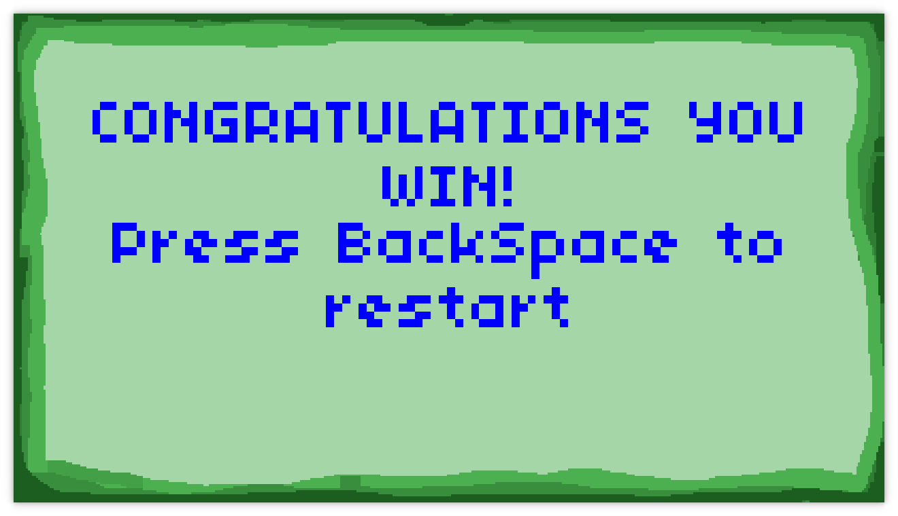
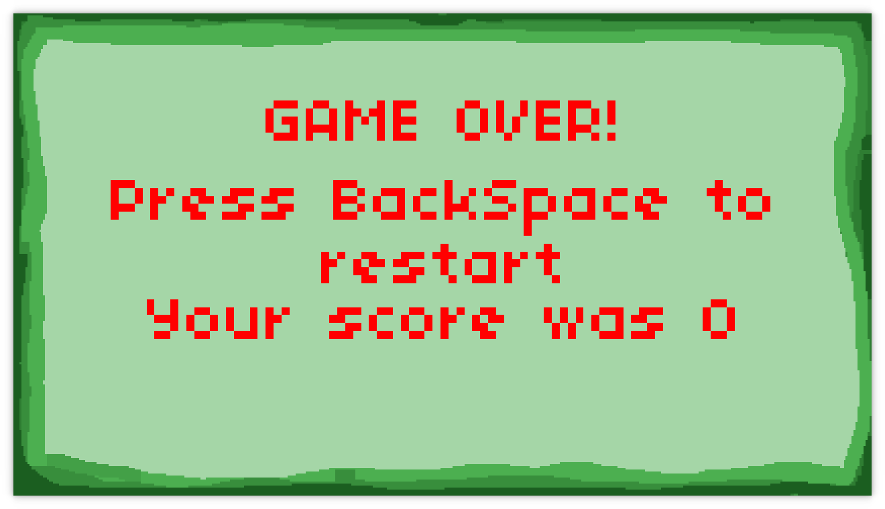
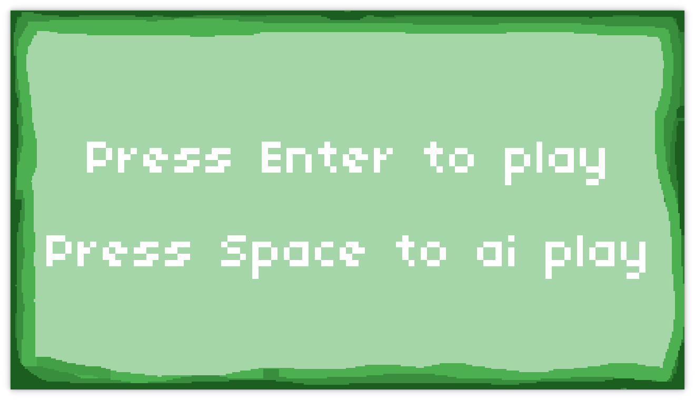

# <center><h1>🐍 Snake Game V2 🐍</h1></center>

### <center><h2 style="font-size:45px; font-weight:bold;">My CS50 Final Project</h2></center>

## - 🧠 About the idea of ​​the game 🧠

As i followed the games track and i'm also passionate about retro games, so i decided to produce my version of the snake game.
When I was in the middle of development I decided to create something more, as I am an enthusiast in the field of artificial intelligence, I went after creating the AI ​​play option, however as I do not have all the knowledge about, I soon used a simpler device. What I used was a simple algorithm that observes which direction brings the character closer to the apple, giving the slight impression that the character knows what he is doing.
moreover, I decided to add some things in the right game that would make it more difficult, since I removed the collisions with the tail.
<br><br>

## - 👨🏻‍💻 About project 👨🏻‍💻

This game has been made with Lua and LÖVE engine.<br>
<br>

In this project we have those archives:

- <strong>main.lua:</strong> This archive have the instructions to make the visual part of game;
- <strong>Decision.lua:</strong> This archive is a simple library used to make decisions in the AI play;
- <strong>push.lua:</strong> A library to make more simple the production of the visual part of your game;
- <strong>fonts:</strong> Inside this folder there is the font used;
- <strong>assets:</strong> This folder has the all images of the game;
- <strong>sounds:</strong> Inside this folder we can found the sound effects used in the game;
- <strong>images:</strong> Used images in this md file.

  <br><br>

## - 👾 About the game 👾

In this version of snake game we have two choices:

1. Human Play
   - You can play normally, how in the original game.
2. Ai play
   - the machine plays the game.
     In this version of the snake game I chose to remove the snake's collision with the tail and add some obstacles, of which are:

- <strong>Bananas:</strong>
When you collide with one of them your score decreases 1 point, if you collide several times and your score is less than 0 you lose.
There are a total of 11 bananas and they all remove 1 from your score.<br>
when you crash into a banana, your time does not restore and all bananas and apples are moved.
<br></br>
   <center>
      <h2>Banana appearance</h2>
      
      <br><br>
      
   </center>
<br></br>

- <strong>Apple:</strong>
When you touch a apple your score increases by 1, however there are 11 apples on the map and only one increases your score the other 10 do absolutely nothing.<br>
when you collide with an apple your time is restored and all the apples and bananas are moved from position.
<br></br>
   <center>
      <h2>Apple appearance</h2>
      
      <br><br>
      
   </center>
<br></br>

- <strong>Fast 1:<strong>
Fast 1 is a blue region present in 3 regions of the map, where when there is a passage over this obstacle its speed increases by 1, resulting in a speed of 2, however this obstacle can be used to gain an advantage, helping for example to arriving before 5 seconds on an apple, or it can harm, as for example end up passing the wall or hitting a banana.
<br></br>
   <center>
      <h2>Fast 1 appearance</h2>
      
      <br><br>
      
   </center>
<br></br>

- <strong>Fast 2:<strong>
Fast 2 has the same foundation as fast 1 so that in this case it increases its speed to 3.
<br></br>
   <center>
      <h2>Fast 2 appearance</h2>
      
      <br><br>
      
   </center>
<br></br>

when you have a 999 score the games end whit a victory message.
<br></br>

   <center>
      <h2> 🥇 Win example 🥇</h2>
      
      <br><br>
      
   </center>
<br></br>

But case you die.
<br></br>

   <center>
      <h2> 💀 Died example 💀</h2>
      
      <br><br>
      <h2>Losing colliding with wall</h2>
      
      <br><br>
      <h2>Losing by -1</h2>
      
      <br><br>
      <h2>Losing by time</h2>
      
   </center>
<br><br>

## - 🎮 Controls 🎮

- Space (works in initial screen): select the AI play;
- Enter (works in initial screen): select human play;
- Backspace (works in all screens): return to the initial screen;
- Arrow keys (human play): control the direction of snake (human play case).

<br><br>

## - 🔊 Sounds 🔊

The sounds has been made by: <strong>crazyduckgames</strong>
<br>
You can download them in: <a href="https://opengameart.org/content/soundpack-02">soundpack</a>
<br>
His opengameart profile: <a href="https://opengameart.org/users/crazyduckgames">crazyduckgames</a>
<br><br>

## - 🖼️ Sprites 🖼️

All sprites has been made by me, using pixilart web application.<br>
Pixilart can be accessed in: <a href="https://www.pixilart.com/"> pixilart</a>

<br><br>

## - 🏃 How to run 🏃

<center>
   <h1>Linux</h1>
   <h2>PPA (Ubuntu)</h2>
</center>

### 1. Download and install Love2d

```
sudo add-apt-repository ppa:bartbes/love-stable
sudo apt-get update
sudo apt-get install love
```

### 2. Run game

```
git clone https://github.com/Dude-rgb/Snake-game-CS50-final-Project.git
love Snake-game-CS50-final-Project
```

<center>
   <h2>AppImage</h2>
</center>

### 1. Download AppImage on <a href="https://love2d.org/">love2d website</a>

### 2. Add execution permission to the file

```
chmod +x love.AppImage
```

### 3. Run game

```
git clone https://github.com/Dude-rgb/Snake-game-CS50-final-Project.git
./love.AppImage Snake-game-CS50-final-Project
```

<p>NOTE: the name love.AppImage is arbitrary please put the name of your archive</p>

<center>
   <h1>Windows</h1>
   <h2>zip file</h2>
</center>

### 1. Download the zip file on <a href="https://love2d.org/">love2d website</a>

### 2. Get game and run

```
git clone https://github.com/Dude-rgb/Snake-game-CS50-final-Project.git
love.exe Snake-game-CS50-final-Project
```

<p>NOTE: the name love.exe is arbitrary please put the name path of your archive</p>

<center>
   <h2>Installer</h2>
</center>

### 1. Download the exe file on <a href="https://love2d.org/">love2d website</a> and install

### 2. Create a shortcut on your desktop (or other place), go to the path where love is installed and go to `send to desktop`

### 3. Drag and drop the folder (Snake-game-CS50-final-Project) on love2d shortcut

<center>
   <h1>Mac</h1>
</center>

### 1. Download and install <a href="https://love2d.org/">love2d</a>

### 2. check if love has permissions to execute

### 3. Get game

```
git clone https://github.com/Dude-rgb/Snake-game-CS50-final-Project.git
```

### 4. Drag and drop the folder (Snake-game-CS50-final-Project) on love2d app

<br><br>

## - 🤔 How to play 🤔

1. First you need to select the mode of game, case you want to to play press `ENTER` else case you want to see the machine playing press `SPACE`.<br>
<center>

</center>

2. After choosing your game mode, if it has the human play (`ENTER` command) then you must use the arrow keys to change the snake's direction.<br>
   `!ATTENTION!`

<p style="margin-left:50px;">When the game starts you have 3 seconds of invincibility after that the timer starts counting your 5 seconds, if you manage to get the right apple in this time your timer restarts and all apples and bananas, besides be careful also with bananas, all remove one point from your score, restore all positions of apples and bananas and finally keep your accountant by counting your time.</p><br><br>

3. Otherwise if you choose Ai play you simply need to watch the machine trying to win the game.<br>
`!NOTE!`
<p style="margin-left:50px;">All obstacles and features that you had in Human play are present in Ai play except the control with the arrow keys</p><br><br>
<br><br>

4. While the game is running you can return to the home screen using the `Backspace` key or if you want to exit just use the `ESC` key.<br><br>
<center>
   <h2>Return button</h2>
   
</center>

<center><strong><p style="font-size:56px;">And...</p></strong></center>
<br><br>
<center></center>
